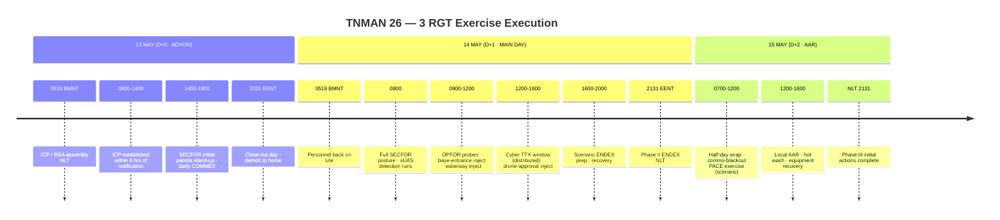

# Exercise Execution Matrix — TNMAN 26 (3 RGT)

> **Draft — pre-decisional.** Prepared for LTC Sheaf review. This is 3 RGT's internal playbook for the ICP — the sequenced list of blue-force actions and scenario touch-points across the exercise window. Not intended for broad distribution; intended as the guide leadership in the ICP follows to make sure the exercise hits all its desired situations.
>
> **What this is:** An **Exercise Execution Matrix** (also called a **Synchronization Matrix** in military doctrine). This is distinct from a **Master Scenario Events List (MSEL)**, which is the *controller's* inject list and is a DIV product (final MSEL review 30 APR 26). This matrix is *blue-force-facing* — what 3 RGT does in response to or in anticipation of scenario events.
>
> **Scope:** 13-15 MAY 26 (ADVON, main day, AAR). Time anchors from [RGT OPORD](opord-rgt.md) phases and [Encl A Storyboard](opord-encl-a.md) objectives.
>
> **Prepared by:** 1LT Overton, ASST S3, 3 RGT · **Date prepared:** 18 APR 26

---

## How to Read This

- **Times are ROMEO (Eastern)** unless otherwise noted. Times before actual execution are planning assumptions — expect 60-90 minutes of slack either side during execution.
- **Swim-lane columns** — each vertical column is a functional track that runs in parallel. The ICP runs all lanes simultaneously; section chiefs own their lane.
- **Injects / Exercise-Control touch-points** are called out in a separate column so the ICP can anticipate what the DIV controllers (MSEL-driven) are likely to deliver. The formal DIV MSEL will supersede these assumptions once issued.
- Entries marked **{inject}** are scenario triggers expected from DIV exercise control. Entries marked **{action}** are 3 RGT blue-force actions. Entries marked **{report}** are reporting requirements.

---

## Summary Timeline (Milestone View)

---

## 13 MAY 26 (D+0 · ADVON / ICP Establishment)

*Goal: Establish ICP at the Armed Forces Reserve Center within 6 hrs of notification; stand up communications; begin initial perimeter posture at Holston AAP.*

| Time (R) | ICP C2 | SECFOR | UAS / Air | Comms | Exercise Control Touch-Point | Sustainment |
|----------|--------|--------|-----------|-------|------------------------------|-------------|
| **0519 BMNT** | Receipt-of-tasking NLT; assembly begins | All sections present for accountability muster | Part 107 pilot on site; pre-flight equipment check | TACN/HF/cell/FirstNet tested | — | Initial Class I on site |
| **0600-0800** | ICP site setup: C2 equipment, SITMAP, LNO positions; COL Roark + staff principals present | Roster verification; PPE/kit check; ROE brief (JAG-verified card); battle-buddy pairing | sUAS mission brief; confirm airspace coordination w/ HAAP | S6 activates Signal Annex; radio checks with JOC, Holston AAP, DIV HQ | **{inject}** *"Attack begin"* (per Encl A storyboard) | Feeding plan confirmed w/ BNs; vehicles staged |
| **0800-1000** | Initial SITREP to DIV G3; LNO from 2 RGT and 4 RGT inbound; DIV PMO LNOs (×2) check in | **First dismounted foot patrol** rotates forward to vic NAIs 3002 (Main Gate) and 3010 (US-11W) | Detection-test mission #1: sUAS reconnaissance along east perimeter (NAI 3003/3004) | Daily COMMEX window opens (HF check w/ JOC + DIV) | — | Hydration / Drip Drop issue |
| **1000-1200** | 6-hour "ICP established" gate — report to DIV G3 per DIV OPORD 6-hr task | **Screen element** established between Main Gate and river approach (NAI 3002 → 3007) | Detection-test mission #2: south/waterway sector (NAI 3007, Holston River) | TACN daily check | **{inject}** Coordination call from HAAP Security re: drone-approval process (test) | Mid-day accountability |
| **1200-1400** | **Operational Brief to DIV G3** (SITREP/ADVON complete); DIV LNOs to 3 RGT TF integrate | **QRF element** established at ICP ready-room; coordinate patrol relief rotation | Detection-test mission #3: western rail approach (NAI 3006, 3009) | HF sustainment training for unfamiliar personnel (per RFF/RFS task) | **{inject}** Base-entrance exercise (Netherland Park waterway protection scenario prep) | Noon meal |
| **1400-1800** | Section chiefs consolidate D+0 lessons; brief 14 MAY scheme | Patrol handover rotations; NAI 3008 (Bridge) coverage established | sUAS stand-down; battery / data management (no retained imagery per Imagery guidance) | JOC comms holdover; ensure PACE alternates tested | **{inject}** Possible waterway OPFOR probe (1 RGT role players) | Vehicle refuel; early departure briefing |
| **1800-2031 EENT** | Close-out day; hand SITMAP state to on-call officer; brief any overnight BLOT | SECFOR recovery; all personnel off-site and en route home | — | Comms check-out; S6 plan next-day PACE | — | RON-at-home departures; long-drive Soldiers depart first |

### D+0 Key Reports

- **ICP Established SITREP** to DIV G3 NLT 6 hrs after receipt of tasking (DIV OPORD tasking).
- **Closure / Sensitive-Item Report** NLT 2 hrs after Main Body arrival at mission site (DIV TACSOP — new item from DIV OPORD §3.j.(11).(a)).
- **Daily SITREP** to DIV G3 COB.

---

## 14 MAY 26 (D+1 · MAIN DAY — Simulated Kinetic Attack)

*Goal: Full SECFOR posture on the HAAP perimeter; sUAS detection testing; absorb and respond to the full set of scenario injects (kinetic attack on HAAP + cyber attack on ORNL Eagle-I — the latter affecting DIV G6 / Y-12 / ORNL, not 3 RGT directly).*

| Time (R) | ICP C2 | SECFOR | UAS / Air | Comms | Exercise Control Touch-Point | Sustainment |
|----------|--------|--------|-----------|-------|------------------------------|-------------|
| **0519-0700** | Day-1 battle rhythm starts; all section chiefs brief status | Morning accountability; pass-down from ADVON posture; ROE re-brief | Pre-flight + airspace coord | Full radio check across PACE | **{inject}** Morning scenario update (expected) | Breakfast; hydration |
| **0700-0900** | **Intent brief to all staff** — Commander's 14 MAY priorities; LNOs briefed separately | Full 12-pax dismounted foot patrol rotation launches; 3-pax screen forward; 2-pax QRF at ICP | First sUAS detection sortie (NAI 3003/3004 east perimeter) | Daily HF/TACN COMMEX with JOC + DIV | **{inject}** Initial OPFOR probe near Main Gate (NAI 3002) — non-violent observation of SECFOR response | Sustainment rolling |
| **0900-1030** | Live SITMAP; LNO from 2 RGT routes SA; DIV PMO LNOs forward scenarios | **OPFOR probe response:** patrol reports, QRF on standby (do NOT deploy unless directed), notify HAAP security | sUAS mission #2 — south perimeter / riverbank surveillance (NAI 3007) | Real-time reporting channel active | **{inject}** Drone-approval process test — controller requests real-time drone authorization flow | Water ops |
| **1030-1200** | **CCIR cycle:** ICP reviews FFIR/PIR/EEFI; reports SA to DIV G3 | Patrol relief; screen repositions per observed OPFOR movement | Between-sortie reset; pilot rest cycle | — | **{inject}** Base-entrance inject — suspicious-person / vehicle at NAI 3002 | — |
| **1200-1330** | Lunch battle rhythm; SITREP COB drafted draft | Meal rotation; patrols maintain coverage (no gaps — screen holds during meal) | sUAS mission #3 — railway / ASP access (NAI 3006/3009) | Cyber TTX distributed COMMEX (non-3RGT, SA only) | **{inject}** ORNL cyber scenario runs (DIV G6 exercises — 3 RGT SA only) | Noon meal |
| **1330-1500** | DIV staff VISIT posture possible (FOME for CG visit if scheduled) | QRF live-rehearsal drill (non-inject) — vehicle response to notional alarm at NAI 3008 (Bridge) | sUAS mission #4 — Bridge (NAI 3008) + switch (NAI 3009) | TACN live relay | **{inject}** Waterway threat scenario — Netherland Park / NAI 3007 | — |
| **1500-1700** | Scenario climax window | **Peak SECFOR posture:** all 17 positions manned; QRF tethered to ICP | Final scheduled sUAS sortie; stand-down prep | — | **{inject}** OPFOR climactic probe (per HDWG storyboard objectives) | Begin D+1 recovery prep |
| **1700-1900** | Scenario stand-down; begin wrap | Patrol recovery; accountability; kit turn-in pass-1 | sUAS stand-down; LiPo SOP | Close-out comms; confirm next-day PACE | **{inject}** Possible ENDEX precursor | Hot meal |
| **1900-2131 EENT** | **Phase II ENDEX NLT 142131RMAY26** — demob notification received; close D+1 AAR notebook | Final accountability (100% personnel, sensitive items) | Final battery/data check; aircraft secure | Final comms check; issue out-of-ICP comms plan | **{inject}** ENDEX — Phase II terminates | RON-at-home |

### D+1 Key Reports

- **CCIR / SITREP hourly** during the climax window (1500-1700).
- **ENDEX SITREP** to DIV G3 immediately after 142131R ENDEX.
- **Accountability confirmation** — 100% personnel and sensitive items.

---

## 15 MAY 26 (D+2 · HALF DAY + LOCAL AAR)

*Goal: Local hot-wash and AAR; exercise PACE in response to the comms-blackout scenario inject; recovery of personnel, resources, and capabilities to home of record.*

| Time (R) | ICP C2 | SECFOR | UAS / Air | Comms | Exercise Control Touch-Point | Sustainment |
|----------|--------|--------|-----------|-------|------------------------------|-------------|
| **0700-0900** | Half-day opens; sections present for hot-wash; ICP watch-standing minimized | **Light perimeter posture** — reduced patrol footprint; maintain Main Gate + Bridge coverage only | No sUAS sorties by default (mission complete D+1); airspace closed | **{inject}** Comms blackout — JFHQ exercises PACE / Emergency Comms Plan | — | Breakfast |
| **0900-1030** | **Hot-wash** at ICP — section chiefs + LTC Sheaf + COL Roark | Residual perimeter coverage | — | PACE exercise — alternates (FirstNet ePTT, cell, satellite, JISCC) tested | Comms-blackout exercise in progress | — |
| **1030-1200** | **Local AAR** session — structured AAR by swim lane; notes captured to [AAR Notes](aar-draft.md) | Begin equipment turn-in | — | Begin comms teardown | — | Late morning snacks |
| **1200-1400** | AAR close-out; DIV report drafted | Demob convoy prep; route brief | — | Signal Annex recovery | — | Lunch |
| **1400-1600** | Section chiefs sign off; SITREP to DIV G3; [Comms Log](../comms.md) finalized | Convoy departure; home-station return begins | — | Final check-in on arrival at home station | — | — |
| **NLT 2131R** | **Phase III initial actions complete** per RGT OPORD (24 hrs post-ENDEX) | Home-station arrival; 2-hr NLT closure report to G3 per DIV TACSOP | — | Final comms check at home station | — | — |

### D+2 Key Reports

- **AAR Observations** captured to [AAR Notes](aar-draft.md) (use `/aar` skill during execution).
- **Home-Station Closure / Sensitive-Item Report** NLT 2 hrs after arrival (per DIV TACSOP).
- **DIV AAR submission** follows the +90-day admin close-out cycle.

---

## Main-Day Gantt View (14 MAY)

*Parallel activities by swim lane. This is what the ICP SITMAP effectively looks like if time-collapsed.*

```mermaid
gantt
    title TNMAN 26 — 14 MAY 26 (D+1 Main Day) Parallel Activities
    dateFormat  HH:mm
    axisFormat  %H:%M

    section ICP C2
    Battle rhythm open            :icp1, 05:19, 01:40
    Intent brief                  :icp2, after icp1, 02:00
    SITMAP / CCIR cycle           :icp3, after icp2, 05:30
    Stand-down + ENDEX prep       :icp4, after icp3, 04:00
    ENDEX & demob                 :milestone, icp5, 21:31, 0m

    section SECFOR
    Morning muster + ROE brief    :sec1, 06:00, 01:00
    Full patrol rotation (12)     :sec2, 07:00, 10:00
    Screen forward (3)            :sec3, 07:00, 10:00
    QRF on tether (2)             :sec4, 07:00, 10:00
    Patrol recovery               :sec5, 17:00, 04:31

    section UAS / Air
    Pre-flight                    :uas1, 05:30, 01:30
    Sortie 1 (NAI 3003/3004)      :uas2, 07:00, 02:00
    Sortie 2 (NAI 3007)           :uas3, 09:00, 01:30
    Sortie 3 (NAI 3006/3009)      :uas4, 12:00, 01:30
    Sortie 4 (NAI 3008/3009)      :uas5, 13:30, 01:30
    Stand-down + LiPo SOP         :uas6, 17:00, 02:00

    section Comms
    Daily HF/TACN COMMEX          :com1, 07:00, 02:00
    Real-time reporting           :com2, 09:00, 08:00
    Cyber TTX SA window           :com3, 12:00, 01:30
    PACE close-out                :com4, 19:00, 02:31

    section Exercise Control
    OPFOR probe #1 (NAI 3002)     :inj1, 07:00, 01:00
    Drone-approval test           :inj2, 09:00, 01:30
    Base-entrance inject          :inj3, 10:30, 01:30
    ORNL cyber scenario (DIV G6)  :inj4, 12:00, 01:30
    Waterway inject (NAI 3007)    :inj5, 13:30, 01:30
    OPFOR climactic probe         :inj6, 15:00, 02:00
    ENDEX                         :milestone, inj7, 21:31, 0m
```

---

## Assumptions & Gaps

**Assumptions baked into this draft:**

1. DIV MSEL (final 30 APR) will broadly align with the HDWG storyboard objectives (base-entrance, drone approval, waterway protection, OPFOR probes). Re-baseline after MSEL receipt.
2. ADVON notification (start of the 6-hr ICP-establishment clock) occurs at 0519R / BMNT on 13 MAY.
3. 1 RGT OPFOR (6 pax) are on site at HAAP for all 3 exercise days, 13-15 MAY, subordinate to COL Roark.
4. Dawn-to-dusk + RON-at-home remains in effect; no overnight posture at the ICP (pending resolution of the [1 RGT OPFOR billeting question](../warno-opord-review.md#b3-provide-sleeping-area-for-1st-regt-secfor-personnel-at-icp---open-tension-with-cg-policy)).
5. sUAS mission tests the HAAP drone-detection system — no retained imagery per the 11 APR imagery guidance.
6. Full SECFOR posture (17 pax: 12 foot + 3 screen + 2 QRF) is available once the [Mission Roster](../roster.md) locks and [RFF/RFS](rff-rfs.md) augmentation arrives.

**Gaps this matrix does not yet resolve (planning items):**

- **No DIV MSEL yet** — the "{inject}" entries are 3 RGT's best guess based on the HDWG storyboard; DIV will supersede.
- **Patrol rotation schedule** — specific 4-hour sector rotations not yet allocated by name. Fill once [Task Org SECFOR composition](../taskorg.md#secfor-tf-subordinate-composition-draft) locks.
- **sUAS sortie count and duration** — 4 sorties/day is a planning placeholder; actual cadence depends on battery budget and Part 107 pilot availability.
- **Cyber TTX windows** — precise timing owned by DIV G6; 3 RGT only needs SA, no active participation.
- **ICP watch schedule (overnight)** — 13→14 and 14→15 MAY overnight periods are **uncovered** under dawn-to-dusk policy. Any overnight monitoring (e.g., real-world weather watch, comms handoffs) would require CG policy exception.

---

## Cross-References

- [RGT OPORD 26-05-01](opord-rgt.md) · [DIV OPORD 26-05](opord-div.md) · [CG's Intent](cg-intent.md)
- [Encl A HDWG Storyboard](opord-encl-a.md) · [Operational / NAI Graphics](ops-graphics.md)
- [RFF / RFS](rff-rfs.md) · [Back-Brief](back-brief.md)
- [Timeline](../timeline.md) · [Task Organization](../taskorg.md) · [Mission Roster](../roster.md)
- [DD Form 2977](dd2977.md) · [Risk Assessment](../risk.md)
