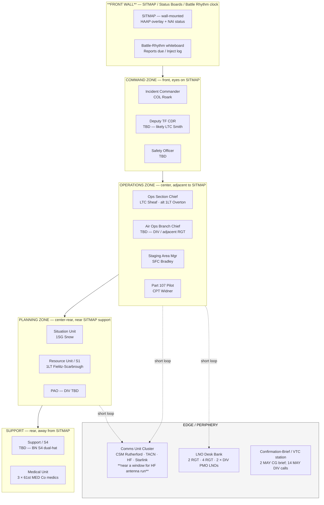
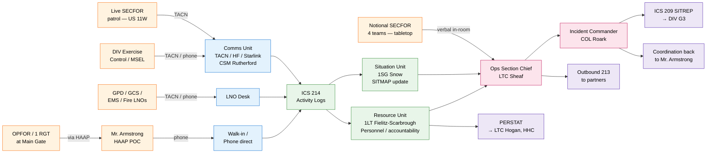

# ICP Layout & Information Workflow

> **DRAFT — pre-decisional · prepared for LTC Sheaf review.**
>
> **Author:** 1LT Aaron L. Overton III, ASST S3, 3 RGT TNSG
> **Date drafted:** 26 APR 26
> **Driver:** LTC Sheaf 26 APR forward of [TNMAN Update](../comms.md): *"I need to start thinking about what the ICP will look like and the work flow of information."*
>
> **Caveats up front:**
>
> - **Recon hasn't happened yet** — scheduled 6 MAY 1500R per [BG Cox AAR](../comms.md). This is a paper-design first pass that assumes a single open bay or room-and-corridor configuration; the actual building plan at the [Armed Forces Reserve Center, 399 A US-11W Scenic, Mt Carmel](../docs/opord-rgt.md) will likely require adjustment.
> - **DIV FRAGO is publishing this week** (per [LTC Estes 26 APR](../comms.md)). May refine HHC LNO posture, the JOC integration, and the 14 MAY inject sequence.
> - **All names below come from the current [Task Organization](../taskorg.md)**; treat any TBD slot here as a re-pointer to the open dependency in that page, not a new gap.

---

## What We're Designing

Two coupled questions:

1. **Layout** — where do people physically sit, what equipment goes with them, what zones share a common purpose? *(Goal: Soldier walking in cold can find the right desk in <30 sec.)*
2. **Information workflow** — when something happens (radio call, partner-agency phone call, observation report, controller inject), what is the path from arrival → logged → SITMAP → decision → outbound reporting? *(Goal: every inbound piece of information has exactly one path and one accountable owner; nothing dies on a desk.)*

Both questions need to land before 12 MAY ICP assembly, which is also when DIV's Final MSEL Review gets digested.

---

## Working Assumptions

Based on what's already been decided or implied by the orders:

| # | Assumption | Source |
|---|------------|--------|
| 1 | **Single open bay** is the most likely configuration at Mt Carmel AFRC. Drill halls / armories typically present this way. Plan for one open room with zone separation by furniture, not walls. | Inferred — confirm 6 MAY recon. |
| 2 | **31 PAX peak on 14 MAY** = 28 organic 3 RGT + 3 attached medics. Of those, ~5 are physically deployed as the live SECFOR patrol on US 11W; the remaining ~26 are at the ICP. | [Estes 26 APR](../comms.md), [BG Cox AAR](../comms.md). |
| 3 | **Dawn-to-dusk operation, no overnight.** ICP shuts down each evening; PACE plan covers any after-hours real-world traffic. | [CG Intent](cg-intent.md). |
| 4 | **HF antenna and Starlink stood up at the ICP** — comms footprint is heavier than a typical 30-PAX ICP because we're testing propagation. | [Estes 26 APR](../comms.md). |
| 5 | **PERSTATs flow up to LTC Hogan (HHC)** throughout 14 MAY — HHC tracking participation, not 3 RGT independently. | [Estes 26 APR](../comms.md). |
| 6 | **JOC at Sidco** has TNSG LNOs at the table behind the desks; we don't run a JOC at Mt Carmel — we report into one. | [Estes 26 APR](../comms.md). |

---

## Notional Floor Plan

Schematic only — **not** a measured drawing. Treat as a placement rationale; metrics fill in after recon.

### Why these adjacencies

- **CMD → OPS → PLANS** stack along the SITMAP wall so the IC, OSC, and the Sit/Resource desk all share one line of sight to the SITMAP and the inject log. **No across-the-room hand-offs** for the most-touched information.
- **Comms cluster on the edge with window/wall access** because the HF antenna run and Starlink dish need physical egress to roof/ground; putting Comms in the middle of the room means cables across the floor.
- **LNO bank between OPS and the door** so partner-agency calls / LNOs walking in from outside don't traverse the operational core to deliver a 213.
- **Medical at the rear** — quiet, has space for triage / privacy if needed, doesn't interleave with operational chatter.
- **VTC station on a side wall** — used twice (2 MAY CG brief; 14 MAY DIV check-ins); doesn't compete with the SITMAP for orientation when it's in use.

### Dimensional placeholders (fill after recon)

| Question | Placeholder | Source/decide |
|----------|-------------|---------------|
| Total bay square-footage | TBD | 6 MAY recon |
| SITMAP wall length needed | ≥ 8 ft for 36×48" HAAP overlay + status panel | 1LT Overton |
| Power outlets per zone | 4× CMD, 6× OPS, 4× PLANS, 4× COMMS, 4× LNOS, 2× SUP/MED | 6 MAY recon — survey |
| Network drops / Wi-Fi | Starlink covers all (planned) — **verify 50-PAX concurrent throughput** | S6 / CSM Rutherford |
| HF antenna feed line | TBD — needs window/wall pass + ground | 6 MAY recon |
| Whiteboards | 2× large (battle rhythm; FFIR/PIR/EEFI) | 1LT Overton — bring or borrow |

---

## Information Workflow

Every inbound piece of information has one canonical path. Most paths converge on the **Situation Unit (1SG Snow)** for SITMAP update before they propagate to the IC and outbound reporting.

### Specific pipelines

**A. Radio call from the live SECFOR patrol (US 11W)**

1. Patrol reports on TACN → **Comms Unit (CSM Rutherford)** receives.
2. Comms operator logs on **own ICS 214** *and* annotates an **inbound message slip** (ICS 213-style).
3. Slip walks to **Situation Unit (1SG Snow)** → SITMAP updated → entered on the inject log.
4. If the report changes posture: Situation Unit notifies **OSC (LTC Sheaf)** → if posture change is significant, OSC briefs **IC (COL Roark)**.
5. IC's decision flows back through OSC → Comms Unit → outbound to patrol.
6. **End-of-period:** all activity rolls into the 1700R **SITREP (ICS 209)** to DIV G3.

**B. Notional SECFOR team activity (tabletop, in-room)**

1. The 4 notional teams are seated in or adjacent to the OPS zone — verbal updates, no radio.
2. Notional team leader briefs **OSC** at fixed cadence (every 30 min during execution windows).
3. OSC summarizes notional activity onto the SITMAP via **Situation Unit** so the SITMAP reflects what would be happening if the teams were physical.
4. This loop also feeds the AAR — notional decisions and would-have-happened actions are training value.

**C. HAAP POC (Mr. Armstrong) communication**

1. Direct phone call → answered by **Comms Unit** or **LNO desk** depending on Armstrong's choice of number.
2. Receiver logs on a **213 immediately** — Armstrong's calls are operationally significant by default.
3. 213 walks to **OSC** for a same-shift response decision.
4. If Armstrong is reporting a real (non-exercise) HAAP event, immediate hand-off to **IC** and pause-exercise consideration.
5. If Armstrong is delivering an exercise inject (e.g., Main Gate scenario at 1300), it's logged and routed normally.

**D. Partner-agency LNO traffic (GPD, Sheriff, EMS, Fire)**

1. Inbound on TACN cross-agency channel **or** phone.
2. **LNO Desk** is the catcher — log on 213, hand off based on category:
   - *Operational:* OSC
   - *Personnel / accountability:* Resource Unit
   - *Medical:* Medical Unit
   - *Press / public:* PAO
3. LNO Desk holds the master partner-LNO contact list (extracts from [Key Contacts](../contacts.md)).

**E. DIV Exercise Control / MSEL injects**

1. Inject arrives via TACN (Comms Unit) or sometimes phone (LNO Desk).
2. **MSEL injects always log to the inject column on the battle-rhythm whiteboard** — visible to the whole room.
3. OSC owns the response decision; IC owns the timing for any "pause exercise" call.
4. Inject responses are logged for the AAR; gives the XO data on how DIV's MSEL landed.

**F. Reporting up — SITREP, PERSTAT, AAR**

| Report | Cadence | Owner | Recipient | Format |
|--------|---------|-------|-----------|--------|
| **PERSTAT** | Throughout 14 MAY | Resource Unit (1LT Fielitz-Scarbrough) | LTC Hogan (HHC) — per Estes 26 APR | DIV-tracking spreadsheet (Estes' Google Sheet) + radio voice |
| **SITREP** | ICP-IOC + every 4 hr + on event | OSC drafts, IC approves | DIV G3 / TEMA | ICS 209 |
| **Daily Hot-Wash** | 1700-1730R 14 MAY | OSC | All ICP staff (in-room) | 30-min structured AAR |
| **TNMAN AAR** | 15 MAY 0700-1200 | OIC (TBD) + OSC | DIV staff | Format TBD; companion to [AAR Notes](../aar-draft.md) |

---

## Open Questions for LTC Sheaf

These are the decisions the layout / workflow can't make on its own. Listed in order of how soon they need to be answered.

1. **Single open bay vs. multi-room?** Drives whether "zones" are physical or just placement-by-furniture. *(Answered after 6 MAY recon.)*
2. **TF Commander designation** — IC role assumes COL Roark. If the TF CDR vs. IC are split (COL Roark IC, MAJ Crosby TF CDR for SECFOR), the diagram needs an additional "TF Forward" cell connected to the IC by a phone/radio link — MAJ Crosby is forward at the live patrol position, not in the bay.
3. **Deputy TF CDR — LTC Smith yes/no?** Drives whether the "Deputy TC" cell is filled or stays TBD.
4. **Air Ops Branch Chief sourcing** — the diagram has Branch Chief TBD with CPT Widner as the sole organic Part 107 pilot. If Branch Chief comes from DIV / adjacent RGT, where do they sit and to whom do they report?
5. **Safety Officer designation** — DD 2977 blocker; also a layout question (Safety in CMD zone has visibility on patrol activity and the inject log).
6. **Notional SECFOR "in-room" placement** — should the 4 notional teams be physically grouped in the OPS zone, or a separate "tabletop SECFOR" subgroup along a side wall? Trade-off is room density vs. OSC's span of control.
7. **DIV FRAGO content** — publishing this week per Estes. May add HHC LNO requirements at the ICP (Hughes / Barbas / Coulter / Jernigan / Hogan) that need their own desk space.

---

## Updates Expected After 6 MAY Recon

- **Floor plan grid** — actual square footage, wall dimensions, window/door positions.
- **Power and network survey** — outlet count, panel locations, Starlink line-of-sight to sky.
- **HF antenna feed path** — confirm where the run goes through wall/window, ground requirement.
- **Furniture inventory** — what's in the building vs. what 3 RGT brings (tables, chairs, easels, projectors).
- **Parking + arrival flow** — where do Soldiers park, where do they sign in, where do they pick up kit.
- **Photos** — adds a "Reference Photos" section at the bottom of this page.

This page revs after the recon. Ahead of 12 MAY ICP assembly, version is "draft v2" reflecting recon findings.

---

## Related

- [Task Organization](../taskorg.md) — names and roles
- [ICP Org Reference](../icp-org-reference.md) — ICS structural template
- [Execution Matrix](execution-matrix.md) — what happens, when (BG Cox 14 MAY beats)
- [Operational / NAI Graphics](ops-graphics.md) — SECFOR posture and NO-GO Line
- [Mission Roster](../roster.md) — 28 organic + 3 attached medics
- [Chain of Command](../coc.md) — formal CoC (separate from ICP task org)
- [FRAGO 26-05-01.1](frago-26-05-01-1.md) — TAK/TACN VTC, CG brief, Leader's Recon
- [Comms Log 26 APR](../comms.md) — BG Cox 14 MAY beats, Estes DIV-wide update, HF freq request
