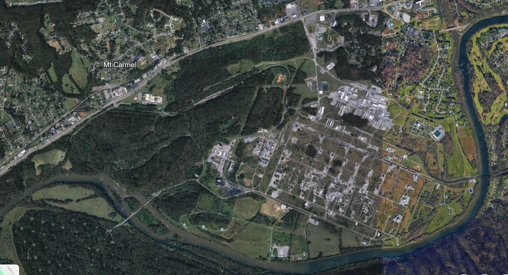

# Operational & Intelligence Graphics — NAI Overlay

> **Source files (17 APR initial):**
> - [ops-nai-graphics.pptx](/docs/source/ops-graphics/ops-nai-graphics.pptx)
> - [base-map.jpeg](/docs/source/ops-graphics/base-map.jpeg)
>
> **Source files (current — 21 APR 26, Enclosure A to [FRAGO 26-05-01.1](frago-26-05-01-1.md)):**
> - [OPS-NAI-Graphics.pptx](/docs/source/OPS-NAI-Graphics.pptx) — SECFOR / sUAS overlays with NO-GO Line; minor position-label refinement vs. 20 APR
> - [TPFDD-Ops-Sequence.xlsx](/docs/source/TPFDD-Ops-Sequence.xlsx) — hour-by-hour personnel sequencing 13-17 MAY, **now includes preliminary scenario event row** (see [FRAGO page](frago-26-05-01-1.md#editors-notes))
> - [TNSG-TNMAN-Calendar-20APR26.xlsx](/docs/source/TNSG-TNMAN-Calendar-20APR26.xlsx) — DIV synch matrix
>
> **Status:** **Enclosure A to FRAGO 26-05-01.1.** Initial overlay distributed by LTC Sheaf 17 APR 26 to COL Roark, CSM Seals, LTC Smith, 1LT Overton (cc: LTC Smith Scott, CSM Rutherford, CPT Borrilez, MAJ Crosby, CPT Haddix, CW4 Simpson, 1LT Fielitz-Scarbrough, SFC Bradley). Updated 20 APR 26 after LTC Sheaf call with Mr. Armstrong (HAAP POC); 21 APR 26 re-issued with FRAGO.

## Purpose

Operational / intelligence graphic for use during TNMAN-26 execution at Holston Army Ammunition Plant. Establishes the Named Areas of Interest (NAIs) and the TNNG/TNSG boundary for SECFOR posture along the HAAP perimeter.

## Named Areas of Interest (NAIs)

| NAI | Description |
|-----|-------------|
| **3001** | **ICP** — Incident Command Post location |
| **3002** | Main Gate Access Point |
| **3003** | Critical Infrastructure — 1 |
| **3004** | Railway / Pipeline Access |
| **3005** | Critical Infrastructure — 2 |
| **3006** | Railway / ASP Access Point |
| **3007** | Waterway Access Point (Holston River) |
| **3008** | Bridge |
| **3009** | Railway Switch / Access Point |
| **3010** | US-11W |

## Boundary & Posture Notations (from the graphic)

- **TNNG | TNSG 3 / 3** and **TNSG | TNNG 3 / 3** — boundary markers between TNNG and 3 RGT / TNSG areas of responsibility along US-11W
- **S** — Screen line symbol
- **P, P, P** — three Patrol positions placed between the screen and the ICP
- **US-11W** — primary north-south reference axis

## Employment Notes

- NAIs align with the DIV OPORD 26-05 tasking for 3 RGT: *"Provide ground and air (UAV) security with roving patrols to support and secure the Holston Army Ammunition Depot"* and the end-state language *"well-developed and supportive perimeter ground and air security."*
- The Screen (S) and Patrol (P) posture maps cleanly to the [RFF/RFS](rff-rfs.md) SECFOR breakdown: **12 foot patrol + 3 screen + 2 QRF = 17 pax** total on the perimeter.
- **Perimeter-only constraint** still governs: no TNSG personnel enter HAAP premises. NAI 3001 (ICP) sits outside the perimeter at the **Armed Forces Reserve Center, 399 A US-11W Scenic, Mt Carmel, TN 37645** (referred to in DIV OPORD as "Mt. Carmel Armory" and in RGT OPORD as "US Army Reserve Center, Mt Carmel" — same facility).
- sUAS reconnaissance at HAAP (per [Imagery guidance 11 APR](../comms.md)) does **not** generate retained imagery — the sUAS mission tests the installation's drone detection system. NAIs inform sUAS patrol patterns but no NAI imagery products are produced.

### Mr. Armstrong guidance (20 APR phone call — see [Comms Log](../comms.md))

The HAAP POC added constraints that **physically tighten** the SECFOR / sUAS / OPFOR footprint beyond the graphics alone:

- **sUAS: do not fly past the "No Go" line.** Detection of intrusion is Mr. Armstrong's chief training objective.
- **SECFOR (physical):** only patrols **outside the perimeter fencing AND parallel to the southernmost side of US 11W** (i.e., along the HAAP-facing edge of the road). This narrows the physical footprint compared to the 15-team N/S/W zoning shown in the TPFDD.
- **SECFOR (notional):** all interior patrols and screens — the N/S/W zoning and interior screen positions in the graphic and TPFDD — are **tabletop only**, not physically walked.
- **OPFOR:** non-confrontational, confined to the **main gate only**. Main-gate staff will be aware the exercise is occurring but will not know when or where.

## Open Items

- **S2 refinement** — LTC Sheaf explicitly invited S2 refinement. 1SG Snow (HHC S2 NCO) is tasked to develop the SA brief and further NAI work. [SA Brief](sabrief.md) is the parent product.
- **Weather overlay** — the 1SG Snow SA brief is expected to layer weather considerations onto this graphic.
- **Integration into Back-Brief** — the [Orders Back-Brief](back-brief.md) references this NAI scheme as the graphical representation of the 3 RGT SECFOR concept.

## Base Imagery

*Underlying satellite imagery from the PPTX. PPT-rendered overlay (NAI labels, TNNG/TNSG boundary, Screen and Patrol positions) is in the source .pptx.*

---

## 20 APR Update — SECFOR Posture, NO-GO Line, TPFDD

After LTC Sheaf's 20 APR call with Mr. Armstrong, the SECFOR picture was expanded and the sUAS employment clarified. See [OPS - NAI Graphics.pptx](/docs/source/OPS-NAI-Graphics.pptx) for the updated graphics (8 slides).

### Expanded SECFOR Employment

The 17 APR "Screen + 3 Patrols" posture was expanded to **15 × 5-PAX SECFOR teams** in the TPFDD:

| Element | Teams | Zone |
|---------|-------|------|
| Screen | 3 | Screens 1–3 |
| Patrol North | 4 | Patrols 4–7 |
| Patrol South | 4 | Patrols 8–11 |
| Patrol West | 4 | Patrols 12–15 |
| Reserve / QRF | 2 | QRF 16, QRF 17 |

This expanded posture is what the [RFF / RFS](rff-rfs.md) requests from DIV.

### Patrol-Zone Distances (24 APR update)

LTC Sheaf annotated the SECFOR Patrol Ops slide with approximate distances from the ICP to the patrol zones: **~2200 m** and **~2700 m**. Useful SECFOR TF planning detail for foot-movement times, comms range, and medical evac response.

### NO-GO Line

A **NO-GO Line** along the HAAP perimeter fence is absolute — no TNSG personnel or sUAS cross it. sUAS operates outside the NO-GO Line; the purpose is to test HAAP's drone detection system, not to generate imagery of the installation interior.

### TPFDD — 54 Actual / 70 Notional / 124 Total at 14 MAY peak

The **23 APR TPFDD** (`Mt. Carmel Site Defense` sheet — renamed from `TNMAN-26` to match the FRAGO operation name) formalizes the physical-vs-tabletop split Mr. Armstrong laid out on 20 APR. The former "Peak 124 PAX" figure is now decomposed:

| Line | PAX | Meaning |
|------|----:|---------|
| **Estimated Actual PAX** (physical, on-ground) | **54 peak on 14 MAY** | What will physically be at HAAP on the day — the number the Staging Area Manager, risk planning, and medical support sizing work from. Ramp: 17 → 23 → 31 through 13 MAY; 54 from 14 MAY 0800; dip to 49 mid-day 14 MAY; 54 through 15 MAY AAR. |
| **Notional Total PAX** (tabletop only) | **70 constant across window** | Interior SECFOR patrols and screens (N/S/W zoning, interior screen positions) exercised as tabletop inside the ICP; not physically deployed to HAAP. |
| **Estimated Total PAX** | **124 peak on 14 MAY** | Sum for sizing / request-for-forces purposes; retained because the RFF, CG brief, and DIV coordination still reference it. |

Element composition (unchanged from 21 APR):

| Element | PAX | Active window |
|---------|-----|---------------|
| ADVON | 11 | 13 MAY 0900 – 15 MAY 2030 |
| SECFOR × 15 teams | 75 | 14 MAY 0800 – 15 MAY 2030 |
| OPFOR (from 1 RGT) | 8 | 13 MAY 1100 – 14 MAY 2030 |
| LNOs (2 RGT, 4 RGT, 2 × PMO) | 4 | 13 MAY 0900 – 15 MAY 2030 |
| JAG | 1 | 13 MAY 0900 – 15 MAY 2030 |
| PAO | 1 | 13 MAY 0900 – 15 MAY 2030 |
| TACN Radio (3 positions) | 3 | 13 MAY 1000 – 15 MAY 2030 |
| HF Radio (3 positions) | 3 | 13 MAY 1000 – 15 MAY 2030 |
| Field Medical (61st / 31st MED Co) | 3 | 14 MAY 0800 – 15 MAY 2030 |
| §107 sUAS operators | 5 | 14 MAY 0800 – 15 MAY 2030 |
| **Peak total** | **~124** | 14 MAY all day |

Draw-down starts 15 MAY evening: transition to AAR and travel home; final 3 ADVON PAX off-site by 16 MAY 0730.

**Planning implication:** where a number matters *operationally* (medical / hydration / bathroom / parking / chow / transport), use **54 actual**. Where it matters *administratively* (RFF, DIV briefing, CG situational awareness, task-assignment math), continue to use **124 total**. The TPFDD also adds a **"Notional"** status code to the legend so notional rows can be flagged per hour.

### Certified Part 107 Pilots (as of 19 APR)

- **CPT Matthew W Widner** (4 BN XO)
- **1LT Michael W Riley** (3 BN XO)
- **LT Sam Hoskins** (3 RGT / 4 BN) — earned Part 107 on 19 APR 26

### DIV Synch Matrix (LTC Estes, 20 APR 26)

| Day | Scenario | 2 RGT | 3 RGT | G6 | DIV ENG |
|-----|----------|-------|-------|-----|---------|
| 11 MAY Mon | Natural Disaster | UAS travel | — | — | — |
| 12 MAY Tue | — | Drone Mapping Fall Creek Falls | — | — | — |
| 13 MAY Wed | — | Drone Mapping | **Travel to Mt Carmel** | — | JBAT Training Nashville |
| 14 MAY Thu | Coordinated Attack | Travel Home | **Mt Carmel Site Defense** | Cyber | JBAT Bridge Assessment |
| 15 MAY Fri | COMMS Blackout | — | **Mt Carmel AAR, Travel Home** | — | — |
| 16 MAY Sat | — | — | — | — | — |
| 17 MAY Sun | — | — | — | — | NG JABS AAR |
