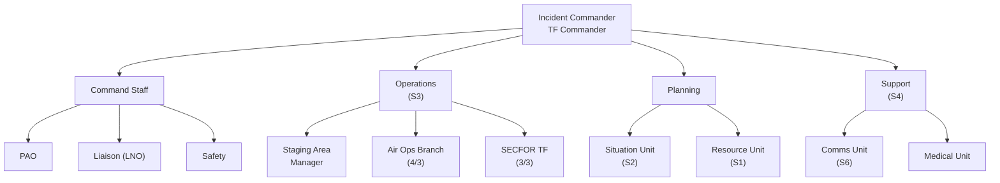

# Task Organization

> **Status:** Draft. Uses the [ICP Organization reference](icp-org-reference.md) provided by LTC Sheaf as the structural template. Populated from the current [Mission Roster](roster.md). Every TBD must be resolved before orders issue on 30 APR 26.

## Structure Overview

## Incident Commander / TF Commander

| Role | Proposed | Notes |
|------|----------|-------|
| Incident Commander / TF Commander | **TBD — LTC Sheaf to confirm** | Two candidates: **COL Roark** (RGT CO, consistent with rank seniority) or **MAJ Crosby** (3 BN CO, since 3 BN is Focus of Main Effort). The OPORD is silent on this. LTC Sheaf to designate. |
| Deputy TF Commander | **TBD** | Typically the TF Commander's XO. If COL Roark is TF CDR, deputy would be LTC Smith. If MAJ Crosby is TF CDR, deputy would be 1LT Riley (3 BN XO). |

## Command Staff

| Role | Proposed | Notes |
|------|----------|-------|
| **Public Information Office (PAO)** | **TBD** — pending assignment via LTC Epright (DIV PAO) | Open item on the [Mission Roster](roster.md). No 3 RGT personnel currently fills this slot. |
| **Liaison Officer (LNO)** | **TBD — LTC Smith or TF XO recommended** | LTC Smith (RGT XO) has the seniority and breadth of contacts to coordinate across TNNG, TEMA, HAAP, and supporting agencies. Alternative: one of the BN XOs. **Note:** CG intent also assigns 2 RGT LNO, 4 RGT LNO, and 2 DIV LNOs to 3 RGT TF — coordinate with incoming LNOs. |
| **Safety Officer** | **TBD — designation required** | No current 3 RGT Safety Officer on the mission roster. Must be designated before execution (also a [DD 2977](docs/dd2977.md) dependency). LTC Sheaf to assign. Recommend an MRC-1 officer with prior safety experience. |

## Operations Section (S3)

| Role | Proposed | Notes |
|------|----------|-------|
| **Operations Section Chief** | **LTC Sheaf (RGT S3)** — primary. **1LT Overton (ASST S3)** — alternate / battle captain. | LTC Sheaf is MRC-2; role-limited to ICP-interior by DD 2977. If LTC Sheaf is TF XO or LNO instead, 1LT Overton assumes Ops Section Chief. |
| **Staging Area Manager** | **TBD — HHC to provide** | No named Staging Area Manager. Needs an officer or senior NCO from HHC or an available BN. Candidate: **SFC Bradley** (HHC Rec NCO, MRC-1) if no higher-priority tasking. |
| **Air Operations Branch (4 / 3)** | **Branch Chief: CPT Widner (4 BN XO, Part 107)** **Part 107 Pilots: 1LT Riley (3 BN XO), LT Hoskins (4 BN)** | 3 certified pilots on roster. [Operational / NAI Graphics](docs/ops-graphics.md) TPFDD shows 5 sUAS positions on 14-15 MAY; RFF requests 3 operators total (some from adjacent RGTs). |
| **SECFOR Task Force (3 / 3)** | **TF Chief: 1LT Riley (3 BN XO)** **Acting BN 1SG: SFC Ferguson** **Assisting NCO: SFC Sturgill (S3 Ops NCO)** | 3 BN is the Focus of Main Effort (FOME). If MAJ Crosby is TF Commander, 1LT Riley runs the SECFOR TF day-to-day. If COL Roark is TF Commander, MAJ Crosby runs SECFOR with 1LT Riley as his deputy. |

### SECFOR TF Subordinate Composition (Draft)

| Element | Personnel | Notes |
|---------|-----------|-------|
| A Co MP Team | SGT Malone (3 BN, MRC-3 — **single day only**), SGT Overton Ian (3 BN), PFC Human (3 BN), PV1 Gauthier (3 BN, MRC-4 — verify status) | A Co MP personnel from 3 BN |
| B Co MP Team | 2LT Steele (3 BN), PV2 Elrod (3 BN) | B Co MP personnel from 3 BN |
| 4 BN Augment | SSG Whalen (A Co 1SG), SSG Miles (MP Sqd Ldr, MRC-3 — **single day only**), 2LT Neisler (MRC-4 — verify), WO1 Hendon (MRC-4 — verify) | 4 BN named personnel from CPT Widner's list |
| 2 BN Augment (if available) | SFC Collins, SSG Burns (MRC-4 — verify), SSG Lillard, SGT Spence, SGT Walker (MRC-4 — verify), CPL Cate | 2 BN imported from alert roster; availability unconfirmed |

## Planning Section

| Role | Proposed | Notes |
|------|----------|-------|
| **Planning Section Chief** | **TBD** | Not directly staffed in the current roster. Options: **1LT Overton (ASST S3)** — natural fit for planning, though dual-hatted; or **CPT Meager's successor as S1 once identified** (CPT Meager is gone). LTC Sheaf to designate. |
| **Situation Unit (S2)** | **Unit Leader: TBD (no dedicated RGT S2 officer)** **NCO: 1SG Snow (HHC S2 NCO)** | 1SG Snow is the new HHC S2 NCO. No officer directly above him in the S2 chain. May need a Situation Unit Leader designation from HHC. |
| **Resource Unit (S1)** | **Unit Leader: 1LT Fielitz-Scarbrough (HHC S1 Officer)** | Clean fit. 1LT Fielitz-Scarbrough is the RGT S1 and is already responsible for personnel tracking per the OPORD. MRC-2; role-limited to ICP-interior. |

## Support Section (S4)

| Role | Proposed | Notes |
|------|----------|-------|
| **Support Section Chief** | **TBD** | No dedicated RGT S4 officer on the roster. 3 BN has **2LT Garrison (BN S4)** and 4 BN has **2LT Neisler (BN S4, MRC-4 — verify)**. One of the BN S4s is likely dual-hatted as the task force S4 at ICP. LTC Sheaf to designate. |
| **Communications Unit (S6)** | **Unit Leader: CSM Rutherford (new 3 RGT S6 NCO)** **3 BN S6: SSG Singh** **3 BN S6 C&E Officer: CPT Moore (MRC-4 — verify)** | CSM Rutherford is the RGT S6 per LTC Smith's 2 APR email. SSG Singh moved from HHC to 3 BN as S6. Communication plan status is blocked on unresolved TACN radios, ATAK training, and Starlink — see [G6 Questions email](comms.md). |
| **Medical Unit** | **3 Green/Yellow tab medics attached from 61st MED BN (31st MED Co) — names TBD** | Per CG intent. Upgraded from 2 to 3. 61st MED BN CO is BG Cox. No 3 RGT organic medical personnel. |

## Attached Forces

| Unit | Role | Status |
|------|------|--------|
| 61st MED BN (31st MED Co) | 3 Medics (Green/Yellow tab) | Per CG intent; no names / ranks / MRC yet |
| 2 RGT | 1 LNO to ICP | Per CG enabling task; name TBD |
| 4 RGT | 1 LNO to ICP | Per CG enabling task; name TBD |
| DIV Staff | 2 LNOs to 3 RGT TF | Per CG enabling task; names TBD |
| DIV PAO | 1 PAO rep | Per CG enabling task; consolidates with TNARNG PAO |
| DIV Staff | On-site Mob Cell | Individual Orders Production |
| 1 RGT | 6 OPFOR at Holston | 13-15 MAY; not under 3 RGT C2 but on-site |

## Dependencies for Final Task Organization

This draft cannot be locked until the following are resolved. Each item also appears on [Planning Gaps](planning-gaps.md).

1. **Incident Commander / TF Commander designation** — COL Roark or MAJ Crosby. (Blocker)
2. **Safety Officer designation** — someone must be named. (Blocker per DD 2977.)
3. **Operations Section Chief** — LTC Sheaf or 1LT Overton, depending on TF XO / LNO decisions.
4. **PAO representative** — via LTC Epright.
5. **Named 4 BN Part 107 UAS pilot**.
6. **Staging Area Manager designation**.
7. **Planning Section Chief designation**.
8. **Support Section Chief designation** (likely one of the BN S4s dual-hatted).
9. **61st MED BN attachment names and MRC**.
10. **2 BN availability confirmation** (CPT Borrilez) — the 2 BN SECFOR augment cannot be assumed until this lands.
11. **MRC-4 status verification** for 8 personnel currently flagged as unverified.
12. **3 BN CSM vacancy** — confirm interim or acting.
