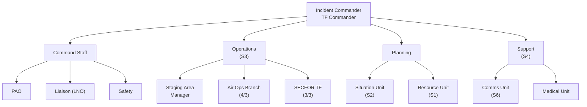

# Task Organization

> **Status:** **Locked at the billet level by the [ICS-203](docs/ics-203.md), approved by COL Roark 29-30 APR 26 and pending FRAGO 26-05-01.2 publication (NLT Sat 2 MAY 26).** This page is the narrative / structural view; the ICS-203 is the authoritative assignment list. Uses the [ICP Organization reference](icp-org-reference.md) as the structural template. **All billets that were "TBD" at the 22 APR mark are now assigned**, except PAO (pending DIV-level fill via LTC Epright) and the 2 RGT / 4 RGT / DIV LNO names.

## Structure Overview

## Incident Commander and Command Staff

> Per [ICS-203](docs/ics-203.md) §3.

| Role | Assignee |
|------|----------|
| **Incident Commander** | COL Robert R. Roark (RGT CO) |
| **Deputy IC** | LTC Joseph S. Smith (Scott) (RGT XO) |
| RCSM (advisor) | CSM Michael L. Seals |
| Chaplain | MAJ Richard A. Bennett (4 BN) |
| **Safety Officer** | SFC DeWayne D. Sturgill (3 BN S3 Ops NCO) |
| **Public Information Officer** | **OPEN** — pending DIV PAO assignment via LTC Epright |
| Liaison Officer | OPEN — incoming 2 RGT (1), 4 RGT (1), DIV (2) LNOs integrate here; 4 RGT candidates floated as MAJ Thomas / MAJ Hamlin per 28 APR comms meeting |

## Operations Section

> Per [ICS-203](docs/ics-203.md) §7.

| Role | Assignee |
|------|----------|
| **Section Chief** | LTC John T. Sheaf (RGT S3) |
| Deputy | 1SG Jeffrey S. Collins (2 BN HQ Co 1SG) |
| Asst Ops Specialist | SGT Tony W. Malone (3 BN A Co MP) |
| **Staging Area Manager** | MAJ Curtis R. Rookard (HHC Eng Officer) |
| **SECFOR Branch Director** | MAJ Lyle A. Crosby (3 BN CO) |
| SECFOR Branch Deputy | SFC Joshua P. Ferguson (3 BN HQ Co 1SG) |
| Screen Division/Group | 2LT Aaron E. Garrison (3 BN S4) |
| Patrol Division/Group | **Notional** |
| Reserve / QRF Division/Group | **Notional** |
| **Air Ops Branch Director** | CPT Michael S. Borrilez (2 BN CO) |
| Air Ops — Pilot 1 | CPT Matthew W. Widner (4 BN XO, Part 107) |
| Air Ops — Pilot 2 | 1LT Michael W. Riley (3 BN XO, Part 107) |
| Air Ops — Pilot 3 | SFC Adam Acosta (SDFF, IRR) |

### Physical SECFOR Footprint (Sheaf 29 APR)

After ICP fills, **4 PAX remain** for the actual screen patrol — one slot short of a 5-man squad:

| PAX | Source |
|-----|--------|
| SSG John R. Whalen (4 BN, A Co 1SG Acting) | likely squad leader |
| PFC Nicholas J. Human (3 BN, A Co MP) | |
| PV2 Charles E. Elrod (3 BN, B Co MP) | |
| PV1 Elrod (3 BN, B Co MP — son, name pending) | |

Plan: **one "almost actual" foot patrol** parallel to the southernmost side of US-11W (consistent with HAAP POC Mr. Armstrong's 20 APR guidance — perimeter-only, southern US-11W only). **Two notional patrols** on the screen line.

## Planning Section

> Per [ICS-203](docs/ics-203.md) §5.

| Role | Assignee |
|------|----------|
| **Section Chief** | 1LT Aaron L. Overton III (HHC ASST S3) |
| Deputy | 2LT Scott T. Sobel (2 BN XO) |
| Resources Unit Leader (RUL) | 1LT Cheryl A. Fielitz-Scarbrough (HHC S1 Officer) |
| Situation Unit Leader | 1SG Michael E. Snow (HHC S2 NCO) |
| Documentation Unit | CPT Travis D. McCroskey (HHC ASST JAG) |
| Tech Specialist (SECFOR) | SSG Matthew E. Miles (4 BN MP Sqd Ldr) |
| Tech Specialist | WO1 Shaleigh D. Hendon (4 BN S1 NCO) |
| Demobilization Unit | OPEN |

## Logistics Section

> Per [ICS-203](docs/ics-203.md) §6.

| Role | Assignee |
|------|----------|
| **Section Chief** | CPT Terrence S. Haddix (4 BN CMDR) |
| Deputy | SFC Timothy W. Bradley (HHC Rec NCO) |
| Service Branch Director | 2LT Mark S. Neisler (4 BN S4) |
| Communications Unit | CSM Michael J. Rutherford (RGT S6 NCO) / SSG Krishna Singh (3 BN S6) |
| **Medical Unit** | **MAJ Markus F. Gampe** (61st MED Co attachment — first named medical PAX; 2 of 3 medics still TBD) |

## Finance / Administration Section

Not staffed — no Finance section roles assigned per ICS-203 §8.

## Agency / Organization Representatives

| Agency / Organization | Representative |
|-----------------------|----------------|
| SDFF / Pilot 3 | SFC Adam Acosta (TNSG IRR) — see [Volunteer Pilots](volunteer-pilots.md) |

## Attached Forces

| Unit | Role | Status |
|------|------|--------|
| 61st MED BN (31st MED Co) | 3 Medics (Green/Yellow tab) | Per CG intent; no names / ranks / MRC yet |
| 2 RGT | 1 LNO to ICP | Per CG enabling task; name TBD |
| 4 RGT | 1 LNO to ICP | Per CG enabling task; name TBD |
| DIV Staff | 2 LNOs to 3 RGT TF | Per CG enabling task; names TBD |
| DIV PAO | 1 PAO rep | Per CG enabling task; consolidates with TNARNG PAO |
| DIV Staff | On-site Mob Cell | Individual Orders Production |
| 1 RGT | 6 OPFOR at Holston | 13-15 MAY; not under 3 RGT C2 but on-site |

## Remaining Open Items

**Resolved by [ICS-203](docs/ics-203.md) (COL Roark approved 29-30 APR 26; FRAGO 26-05-01.2 forthcoming):**

- IC (Roark), Deputy IC (Smith), Safety Officer (Sturgill), Ops Chief (Sheaf), Planning Chief (Overton), Logistics Chief (Haddix), Air Ops Branch Director (Borrilez), SECFOR Branch Deputy (Ferguson), Staging Area Manager (Rookard), all unit leaders, Service Branch Director (Neisler), Medical Unit (MAJ Gampe — first named).

**Still open:**

1. **Public Information Officer** — pending DIV PAO assignment via LTC Epright.
2. **Incoming LNO names** — 2 RGT (1), 4 RGT (1), DIV (2). Per 28 APR comms meeting, 4 RGT candidates floated as MAJ Thomas / MAJ Hamlin (unverified).
3. **61st MED Co attachment — remaining 2 names** (1 of 3 named: MAJ Markus F. Gampe).
4. **MRC-4 / unknown status verification** — Bennett, Neisler, Hendon, McCroskey (MRC-4); Riley, Ferguson, PV1 Elrod (MRC unknown — 29 APR roster blanks).
5. **PV1 Elrod first name and biographical info** — required before he can be added to RGT Orders 26-04-601-3 (currently 30 of 31 organic).
6. **3 BN CSM vacancy** — confirm interim or acting.
7. **DIV orders** — when issued, supersede the 29 APR RGT Orders 26-04-601-3 for any conflict.
